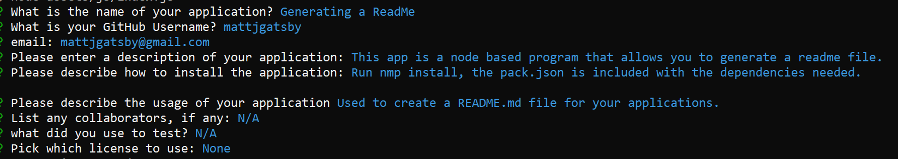

# Generating a ReadMe
  ## Description
  This app is a node based program that allows you to generate a readme file.  

[Watch the demo!](https://watch.screencastify.com/v/uCdLbV1mmxlzKL6IjLSF)

  # Screenshot
 
  

  ## Code Snippet
  This snippet shows the function used access inquirer as well as grab user information that 
  generates a readme file.
  ````
  function init() {
    inquirer.prompt(questions).then((answers) => {
        fs.writeFile('Gen-README.md', generateMarkdown(answers) , (err) => 
        err ? console.error(err) : console.log(answers)
  ````

  
  ## Table of Contents
  * [Installation](#installation)
  * [Usage](#usage)
  * [License](#license)
  * [Contributing](#contributing)
  * [Tests](#tests)
  * [Questions](#questions)
  
  ## Installation
  Run nmp install, the pack.json is included with the dependencies needed.
  
  ## Usage
  Used to create a README.md file for your applications.


  ## Author Links
  [GitHub](https://github.com/mattjgatsby)
  
If you have any questions you can reach me at mattjgatsby@gmail.com.
